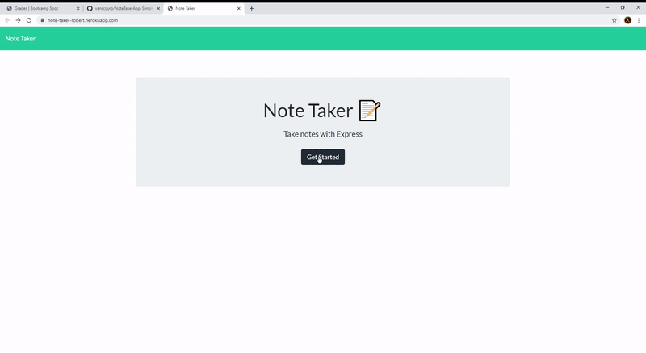

# Note Taker App
### Robert VanScoy
_______________________________________________________________
### Description 
* This node.js program takes user input and allows the user to generate notes and view/delete them

  
### License : 

  
* Info on license: https://opensource.org/licenses/MIT
_______________________________________________________________
### Installation Instructions:
* Once you clone the repo, simply run npm -i from within the Develop folder. This will download all of the dependencies.

_______________________________________________________________

### Main Language : 
* node.js

### Contribution Policy: 
* Feel free to fork and make improvements!
_______________________________________________________________
### Test Cases:
* N/A
_______________________________________________________________
### Contact Me 

* https://github.com/vanscoyro
* rvans003@fiu.edu

### TABLE OF CONTENTS 
_______________________________________________________________
* [Description](#description)
* [License](#license-)
* [Installation](#installation-instructions)
* [Main Language](#main-language-)
* [Contribution Policy](#contribution-policy)
* [Test Case](#test-cases)
* [Contact Me](#contact-me)

    
  
